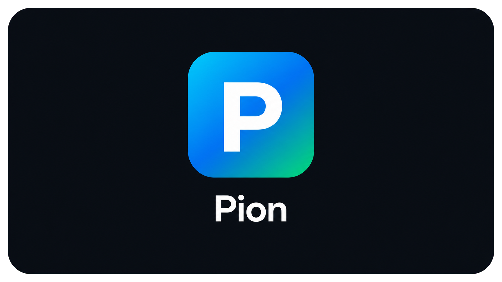

<p align="center">
  
</p>

---

<p align="center">
  <strong>English</strong> | <a href="./README.zh-CN.md">中文</a>
</p>


[](./LICENSE)

Pion is a lightweight, extensible Python coding-agent project inspired by the open-source pi agent; it currently provides a foundation for agent loops, LLM providers, tools, sessions, and hooks, and will evolve through further experimentation and extensions.

## Terminal UI

Running `pion` in an interactive terminal opens the inline TUI — a custom
differential-rendering interface ported from pi's architecture (`pi-tui`).
It draws into the terminal's main screen instead of taking it over: the
transcript *is* your scrollback, and quitting leaves the whole session
visible. Frames are diffed line-by-line and written inside synchronized
output markers, so streaming never flickers. The line-oriented REPL remains
available for low-capability terminals and troubleshooting:

```text
pion                         # inline TUI (default)
pion --ui tui                # explicitly select the TUI
pion --ui plain              # legacy line-oriented REPL
pion --print "your prompt"   # one prompt, then exit; unchanged
pion --session path.jsonl    # resume a session in the TUI
```

An interactive launch requires a TTY. In a pipe, CI job, or other non-TTY
environment, use `--print`; Pion will not attempt to draw the TUI.
Terminals reporting `TERM=dumb` fall back to the plain interface.

The interface follows pi's design language: no window frames — structure
comes from full-width background bands. User messages sit on a dark band,
tool executions are tinted by state (pending/success/error), assistant text
has no chrome at all, and a dim two-line footer shows the working directory,
session name, token usage, cost, context pressure, and the current model.
Tool output is collapsed to its last five lines with a
`... (N earlier lines, ctrl+o to expand)` hint.

Keyboard shortcuts:

| Key | Action |
| --- | --- |
| `Enter` | Send; while running, queue as the next message |
| `Alt+Enter` | Queue as a follow-up (after all queued work) |
| `Alt+Up` | Take the last queued message back into the editor |
| `Ctrl+J` / `Shift+Enter` | Insert a newline |
| `Esc` | Abort the current turn or branch summary; close overlays |
| `Ctrl+O` | Expand/collapse tool output (cycle filters inside the tree) |
| `Ctrl+T` | Show/hide thinking content |
| `Ctrl+L` | Open the model selector |
| `Ctrl+P` | Open the command menu |
| `Ctrl+B` | Open the session tree |
| `Ctrl+Q` / `Ctrl+D` (empty editor) | Exit Pion |
| `Shift+L` | Set or clear a label on the selected tree entry |

Typing `/` at the start of a line opens fuzzy slash-command completion; `@`
opens fuzzy file completion. The editor keeps prompt history (Up/Down at the
first/last line) and supports Emacs-style word navigation and kill keys.

The session tree is a modal selector over the branched JSONL session. Its
filters are `default`, `no-tools`, `user-only`, `labeled-only`, and `all`.
Selecting a user entry moves to its parent and restores the old prompt in
the editor for revision; selecting an assistant, tool result, compaction, or
branch-summary entry moves directly to that point. When this abandons the
active suffix, Pion offers no summary, a default summary, or a summary with
custom focus. Summary generation is transactional: a failure or abort leaves
the active branch and JSONL file unchanged.

Themes are JSON palettes with semantic color tokens (ported from pi), loaded
from `pion/tui/theme/`. Pick one with `/theme dark` or `/theme light`, or set
`"theme": "light"` in `~/.pion/config.json` to make it persistent. Truecolor
terminals get 24-bit color; others fall back to the xterm-256 palette.

The TUI supports `/help`, `/model`, `/compact`, `/stats`, `/tree`, `/theme`,
`/exit`, and commands registered by extensions. Model selection is available
in v1; sandbox, MCP, and profile configuration remain display-only and are
edited through the CLI or `~/.pion/config.json`.

## MCP servers

Pion includes a built-in [Model Context Protocol](https://modelcontextprotocol.io/)
client for stdio servers. Enabled servers are started with Pion, their tools
are discovered automatically, and each tool is exposed to the model as
`<server-name>__<tool-name>`. A server that fails to start is reported and
disabled for that run without preventing Pion or other servers from starting.

Add servers to `~/.pion/config.json`:

```json
{
  "version": 1,
  "mcp_servers": {
    "filesystem": {
      "command": "npx",
      "args": [
        "-y",
        "@modelcontextprotocol/server-filesystem",
        "/absolute/path/to/project"
      ],
      "env": {},
      "enabled": true,
      "timeout_seconds": 30
    }
  },
  "active_profile": null,
  "profiles": {}
}
```

`env` overrides variables only for that child process; other host environment
variables are inherited. Environment values are redacted from Pion's MCP
startup and shutdown errors. The timeout applies to connection setup,
discovery, and tool calls.

MCP stdio servers are trusted host processes. They are **not** run inside
Pion's Docker sandbox and may access resources available to the Pion process.
Only configure servers and commands you trust. This first release supports MCP
tools over stdio; MCP resources, prompts, and Streamable HTTP are not yet
exposed.

## Docker sandbox

Pion runs its default shell and file tools with a Docker sandbox. Docker is
fail-closed: if the CLI, daemon, image build, or container startup is
unavailable, Pion exits before sending a request to the model. Use
`--sandbox off` only when unrestricted host execution is intentional.

The sandbox keeps Pion itself, model credentials, configuration, and sessions
on the host. It creates one disposable, non-root container per Pion process and
bind-mounts only the current project at the same absolute path. Project changes
are therefore visible immediately on the host. Git metadata is read-only by
default, `.env` files are denied to file tools and masked in the container, and
host environment variables and the Docker socket are not injected.

Useful options:

```text
--sandbox docker|off
--sandbox-image IMAGE
--sandbox-network bridge|none
--sandbox-git-write
--allow-project-extensions
```

The default `bridge` network is convenient but does not prevent source
exfiltration. Use `--sandbox-network none` for untrusted repositories. Project
extensions are disabled while sandboxed unless explicitly enabled because
their Python code executes in the host Pion process and can bypass the sandbox.
User-level extensions under `~/.pion/extensions` are treated as trusted host
code.

Sandbox defaults can be stored in the version 1 configuration:

```json
{
  "version": 1,
  "sandbox": {
    "backend": "docker",
    "image": null,
    "network": "bridge",
    "memory_mb": 4096,
    "cpus": 2.0,
    "pids_limit": 256,
    "git_write": false,
    "protect_paths": [".env", ".env.*"]
  },
  "active_profile": null,
  "profiles": {}
}
```

A custom image must already be available to Docker and provide `sleep` plus the
tools needed by the agent. The built-in image contains Python 3.12, uv, Bash,
Git, ripgrep, curl, certificates, and basic compilation tools.

This v1 sandbox is intended for a single-user local coding agent. It protects
host resources outside the project, but it is not a multi-tenant isolation
boundary; cloud deployments should use a VM-, gVisor-, Kata-, or
Firecracker-backed `SandboxRuntime`.
